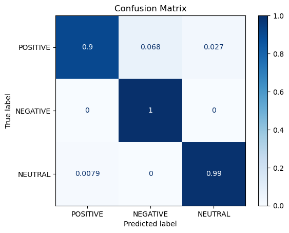

# Emotion recognition utilizing EEG data

In this project we utilize the dataset derived from 

https://www.kaggle.com/datasets/birdy654/eeg-brainwave-dataset-feeling-emotions

towards emotion recognition. In the data creation process, the authors of the conference paper in 

https://www.researchgate.net/publication/329403546_Mental_Emotional_Sentiment_Classification_with_an_EEG-based_Brain-machine_Interface

collected EEG data from 2 people, using movies as stimuli to evoke emotions (Positive, Negative or Neutral). After statistical analysis, features were extracted for each time series. The result is having features of each time series, assigned to emotions. (2548 features per emotion)

In the project we create 3 models to predict a test detaset, and compare them. A K-nearest neighbors classifier, a SVM classifier and a manually tuned deep neural network model of 2 hidden dense layers (with 1024 and 256 nodes respectively). As we observe, comparing metrics such as the accuracy, precision, F1 - score of the models, the SVM classifier and the neural network have better performance.

<figure>
  
  <figcaption>Figure 1:  Confusion matrix of the manually tuned deep neural network model  </figcaption>
</figure>